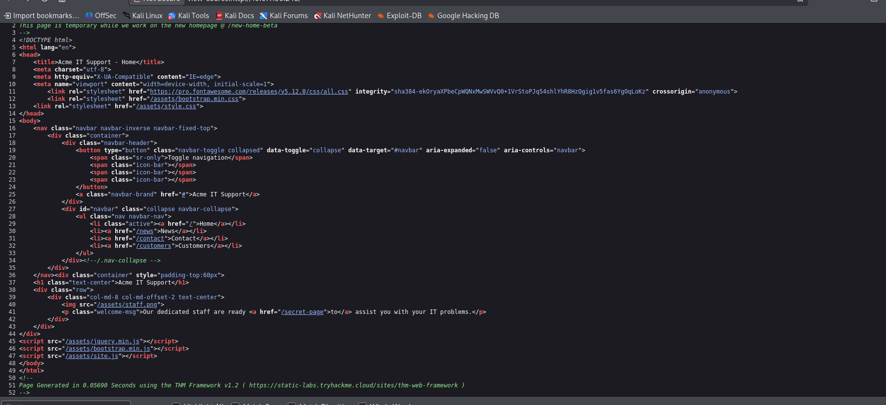
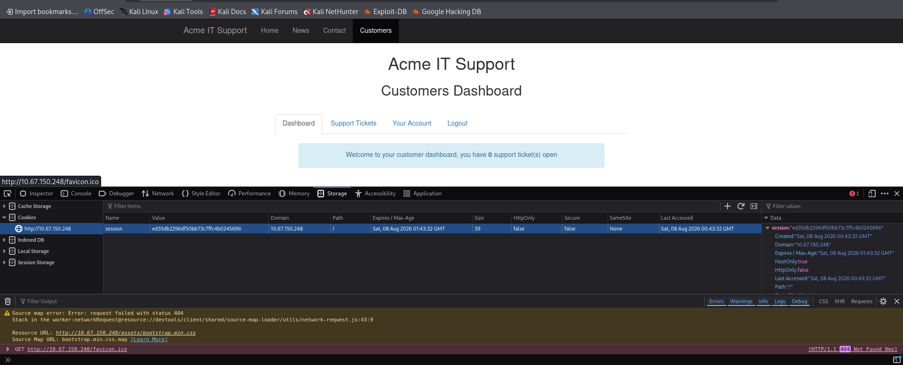

# Acme IT Support: Manual Application Inspection

**Author:** Kaizen Almoite  
**Environment:** TryHackMe — Walking an Application

## The problem

Identify information exposed through the application source, browser behavior and session storage.

## What I investigated

- Inspected HTML source for routes and static assets.
- Paused JavaScript execution to inspect a temporary page element.
- Reviewed a contact-form POST and the customer session cookie.

## What I found

- Source references include `/secret-page`, `/new-home-beta` and `/assets/`.
- Pausing `flash.min.js` kept the temporary flag visible.
- The contact-form request returned HTTP 200 and a JSON response.
- The displayed session cookie had HttpOnly and Secure disabled.

## Recommendations

- Enforce access controls on the server rather than relying on hidden links or temporary page elements.
- Use HTTPS and appropriate session-cookie attributes in deployed applications.

## What I learned

Source exposure, client-side inspection and session configuration are separate observations; none alone establishes account takeover.

## Evidence

**Evidence:** Acme page source exposes /secret-page, /assets/ resources and a comment naming /new-home-beta.

**Interpretation limit:** Source inspection establishes exposed references; it does not by itself prove access to each resource.

**Evidence:** Firefox Debugger is paused in flash.min.js while the temporary flag remains visible on the Acme contact page.

**Interpretation limit:** The screenshot shows client-side inspection, not server-side authorization bypass.

**Evidence:** Firefox Network tab: POST /contact-msg returns HTTP 200 and JSON containing Message Received on 10.67.150.248.

**Interpretation limit:** This proves request/response inspection. It does not show a modified request, injection or an authentication bypass.

**Evidence:** Acme customer dashboard with a session cookie displayed in Firefox Storage: HttpOnly false, Secure false, SameSite None.

**Interpretation limit:** The lab uses HTTP. This is an attribute observation; no session replay, XSS exploit, CSRF exploit or account takeover is shown.
