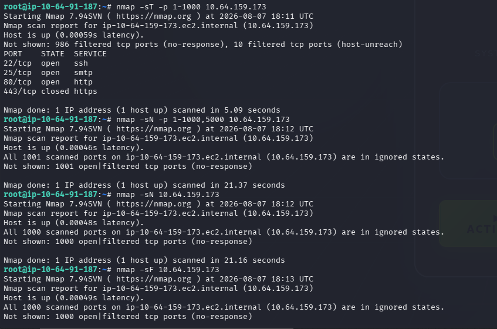
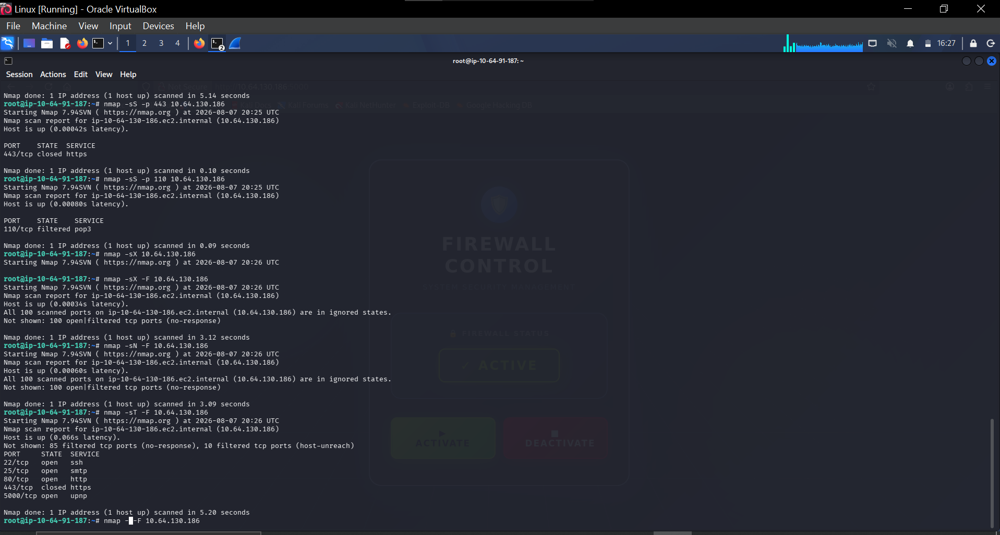
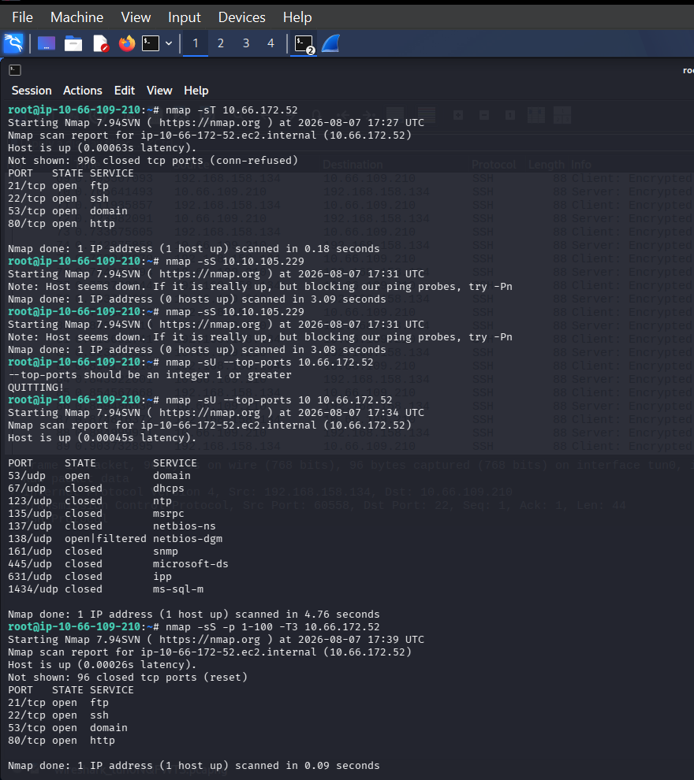
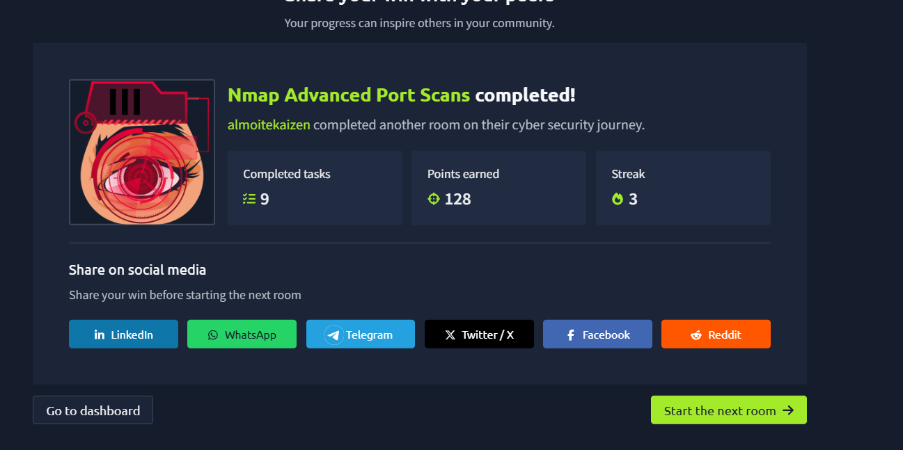
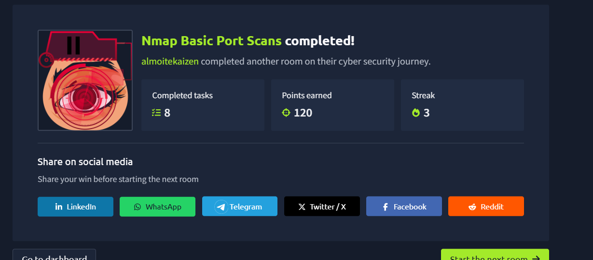

# TCP Connect, NULL and FIN Scan Comparison

**Author:** Kaizen Almoite  
**Environment:** TryHackMe Nmap practice — 7 August 2026

## The problem

Compare the evidence produced by different TCP scan types against the same target.

## What I investigated

- Compared `-sT`, `-sN` and `-sF` results for `10.64.159.173`.
- Checked the command, port scope and time before comparing results.

## What I found

- The earlier connect scan reports nine open ports; NULL and FIN scans classify those ports as `open|filtered`.
- The later connect scan of ports 1–1000 reports ports 22, 25 and 80 open, and 443 closed.
- Later NULL/FIN output reports the scanned ports as `open|filtered`.
- The screenshots do not establish why results changed between runs.

## Recommendations

- Preserve scan type, time and port scope with each result.
- Validate ambiguous states before reporting a service as exposed.

## What I learned

Silence after a NULL or FIN probe preserves uncertainty; it is not equivalent to a successful TCP connection.

## Evidence

**Evidence:** TCP connect scan of 10.64.159.173 followed by NULL and FIN scans on 7 August 2026.

**Interpretation limit:** The later scans are -sN and -sF, not SYN or UDP scans. No response is reported as open|filtered; it does not prove an open port.

**Evidence:** Earlier FIN, NULL and TCP connect results against 10.64.159.173.

**Interpretation limit:** Service names are port labels; no -sV version identification is shown. The later screenshot has different results and scan scope.

## Additional supporting evidence

### Additional target — SYN, Xmas, NULL and connect scans

Against `10.64.130.186`, a SYN scan reports 443/tcp closed and 110/tcp filtered. Xmas and NULL fast scans report 100 ports as `open|filtered`. The connect fast scan reports 22, 25, 80 and 5000 open, with 443 closed. These are separate runs from the earlier `10.64.159.173` comparison.

### Additional target — basic connect and SYN scans

On `10.66.172.52`, the connect scan and the SYN scan of ports 1–100 report TCP ports 21, 22, 53 and 80 open. The screenshot also contains a separate UDP scan and failed discovery of `10.10.105.229`; those results are not TCP exposure findings for the latter host.

### Nmap Advanced Port Scans — completion

The TryHackMe screen shows `almoitekaizen` completing Nmap Advanced Port Scans, with nine completed tasks. Completion is separate from proof of any particular vulnerability.

### Nmap Basic Port Scans — completion

The TryHackMe screen shows `almoitekaizen` completing Nmap Basic Port Scans, with eight completed tasks.

## Investigation details

- [Scan Observations](investigation/scan-observations.md)
