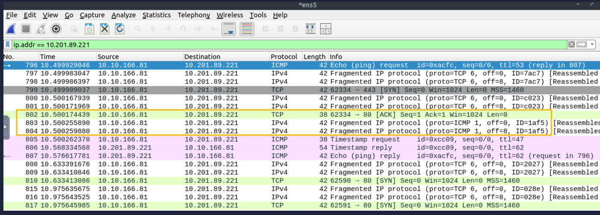
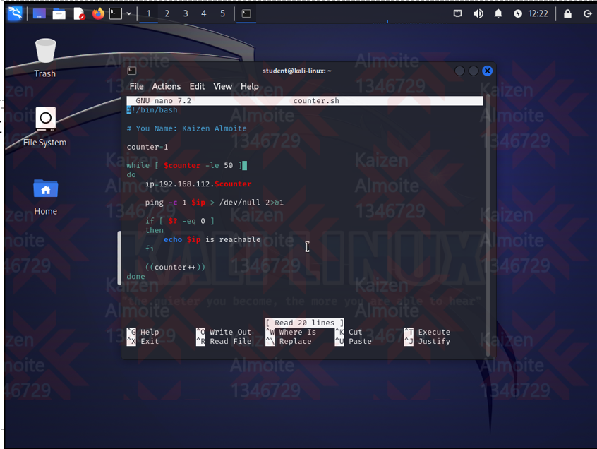
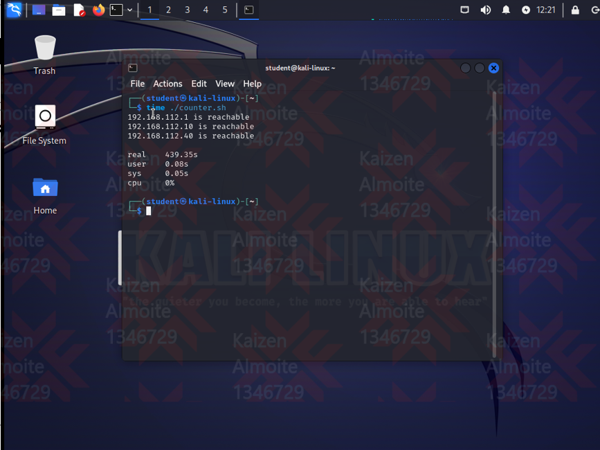
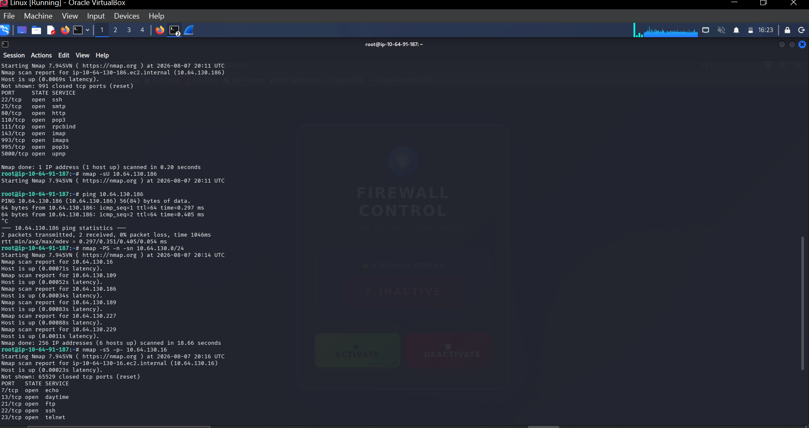
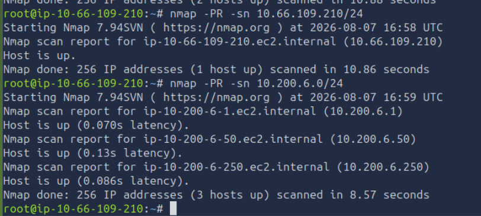
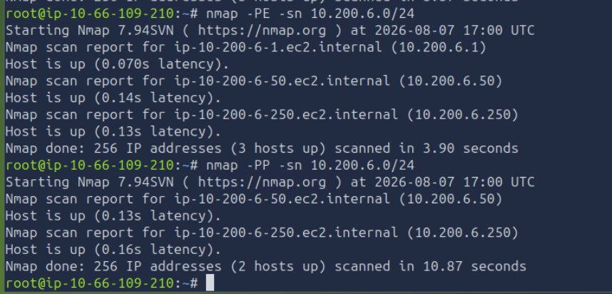

# Host Discovery: Nmap and Bash Reachability Analysis

**Author:** Kaizen Almoite  
**Environment:** TryHackMe Nmap practice and a separate Kali local-lab ping sweep

## The problem

Determine whether the target responds by checking the packets returned to the scanner.

## What I investigated

- Filtered traffic with `ip.addr == 10.201.89.221`.
- Compared source and destination addresses in ICMP echo and timestamp exchanges.

## What I found

- Frames 796 and 807 show an echo request from `10.10.166.81` to `10.201.89.221` and the corresponding reply.
- Frames 805 and 806 show a timestamp request and reply.
- These responses establish target reachability at capture time.

## Recommendations

- Correlate host-discovery conclusions with response packets.
- Treat a missing response as inconclusive unless other evidence establishes that the host is unavailable.

## What I learned

A responding host and an open application port are different findings.

## Evidence

**Evidence:** Wireshark filtered on ip.addr == 10.201.89.221, showing ICMP replies, TCP probes and fragmented IPv4 traffic.

**Interpretation limit:** This is a cropped packet view without a recovered PCAP or generating command. It does not establish MITM interception, compromise or successful firewall evasion.

## Additional supporting evidence

### Kali lab — Bash reachability script

The displayed `counter.sh` loops through `192.168.112.1`–`192.168.112.50`, runs `ping -c 1`, and prints addresses when the exit status is zero. This is a separate local-lab exercise from the TryHackMe discovery targets.

### Kali lab — script execution result

`time ./counter.sh` reports `192.168.112.1`, `192.168.112.10` and `192.168.112.40` as reachable and returns to the shell. Other addresses are not established as offline merely because they are absent from this output.

### Nmap — TCP SYN host-discovery output

`nmap -PS -n -sn 10.64.130.0/24` reports six responding hosts: `.16`, `.109`, `.186`, `.189`, `.227` and `.229`. The same screenshot contains separate ping and port-scan activity. The interrupted `-sU` command shows no UDP result.

### Nmap — discovery runs with -PR

The visible `-PR -sn` runs report one host for `10.66.109.210/24` and three hosts for `10.200.6.0/24`: `.1`, `.50` and `.250`. These command results do not independently prove that every reported host was reached using ARP; packet-level attribution depends on the actual network path.

### Nmap — echo and timestamp discovery comparison

On `10.200.6.0/24`, `-PE -sn` reports `.1`, `.50` and `.250`, while `-PP -sn` reports `.50` and `.250`. The different response sets illustrate why one discovery method can miss a host reported by another.

### Nmap Live Host Discovery — completion

The TryHackMe completion screen identifies `almoitekaizen` and Nmap Live Host Discovery with nine completed tasks. It supports room completion; individual technical findings rely on their command or packet evidence.
