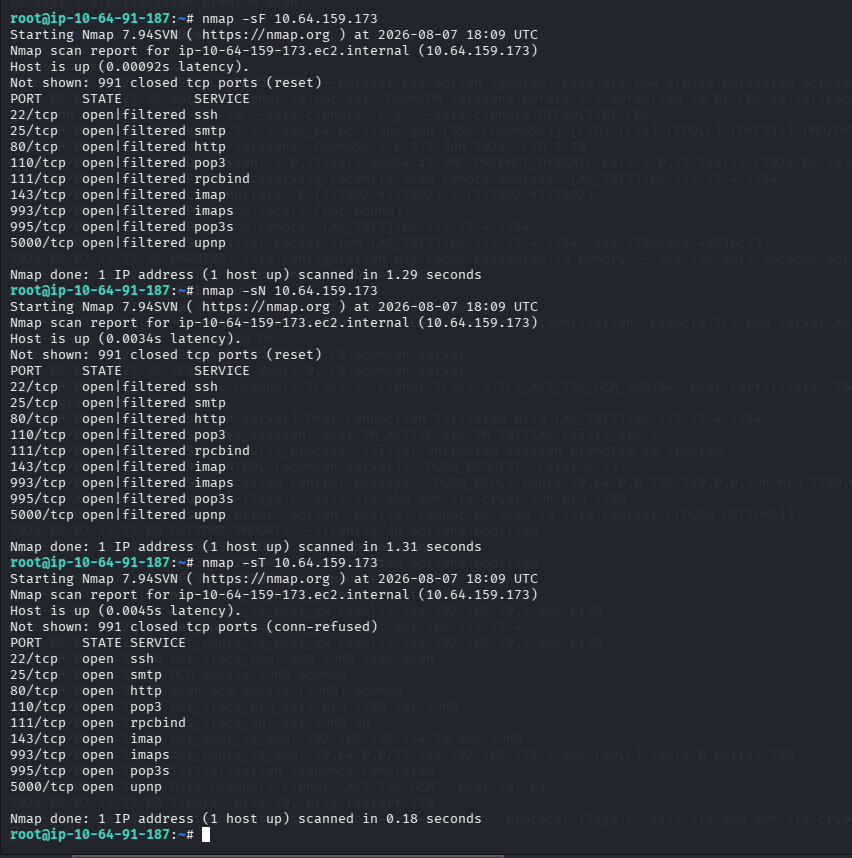
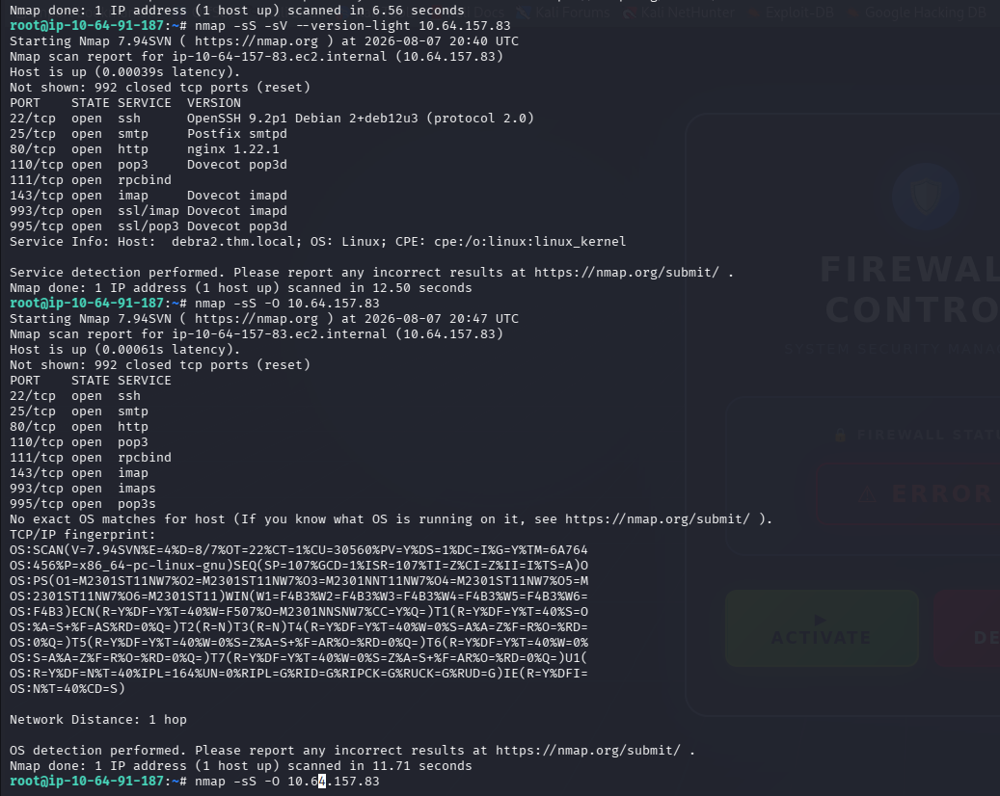
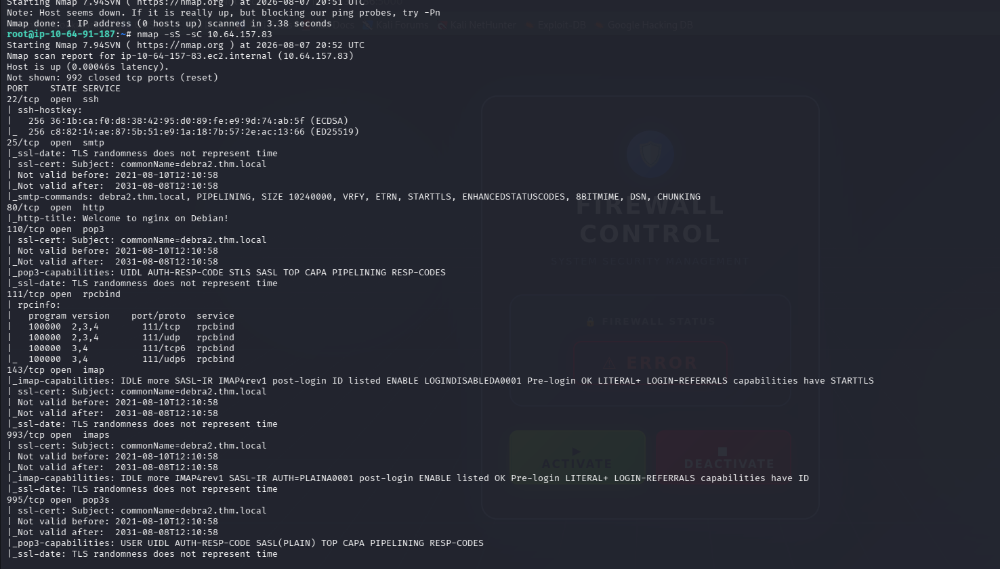
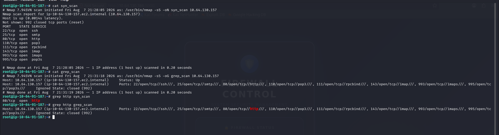

# Service Exposure and Version Enumeration

**Author:** Kaizen Almoite  
**Environment:** TryHackMe Nmap practice — 7 August 2026

## The problem

Identify reachable service ports while separating port labels from verified software identity.

## What I investigated

- Reviewed the earlier TCP connect scan against `10.64.159.173`.
- Compared the reported port states with NULL and FIN results in the same screenshot.

## What I found

- The connect scan reports ports 22, 25, 80, 110, 111, 143, 993, 995 and 5000/tcp open.
- Labels include SSH, SMTP, HTTP and UPnP; these are service-port labels.
- The earlier command is `-sT`, with no version-identification result for that target. Port 5000 alone does not verify a UPnP implementation. Separate version-enumeration results below apply to `10.64.157.83`.

## Recommendations

- Verify protocol and software version before assigning product-specific vulnerabilities.

## What I learned

An open port, a conventional service label and a verified product version represent different levels of evidence.

## Evidence

**Evidence:** Earlier FIN, NULL and TCP connect results against 10.64.159.173.

**Interpretation limit:** Service names are port labels; no -sV version identification is shown. The later screenshot has different results and scan scope.

## Additional supporting evidence

### Separate target — service versions and OS-detection limit

For `10.64.157.83`, `-sS -sV --version-light` identifies OpenSSH 9.2p1 Debian, Postfix, nginx 1.22.1 and Dovecot services. The subsequent `-sS -O` run reports no exact OS matches. These version findings belong to this target, not the earlier `10.64.159.173` port-label screenshot.

### Separate target — default NSE results

`nmap -sS -sC 10.64.157.83` displays SSH host keys, SMTP capabilities, the HTTP title Welcome to nginx on Debian!, RPC information and mail-service capabilities/certificates. Certificate output includes `debra2.thm.local`. Script output does not itself prove exploitability.

### Separate target — saved scan output and filtering

For `10.64.130.157`, the terminal displays normal (`-oN`) and grepable (`-oG`) SYN-scan output. `grep http` selects an HTTP port line from normal output but the host record from grepable output. This screenshot supports output handling, not version detection.

### Nmap Post Port Scans — completion

The TryHackMe completion screen identifies `almoitekaizen` and Nmap Post Port Scans with six completed tasks. Service-identification conclusions are supported by the accompanying execution screenshots.
