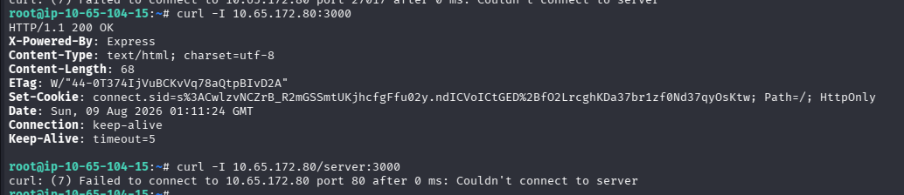
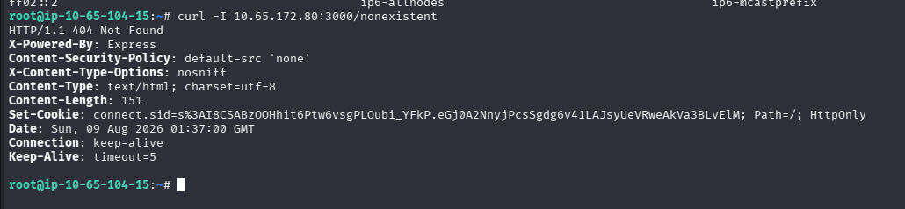
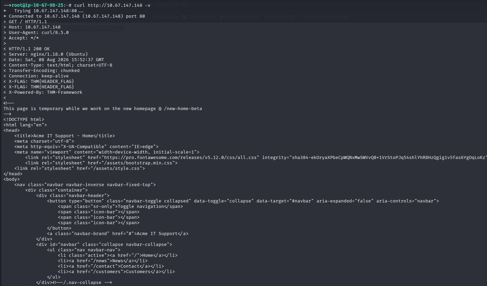

# HTTP Response Inspection with cURL

**Author:** Kaizen Almoite  
**Environment:** TryHackMe MERN / Express identification and a separate Acme IT Support content-discovery session

## The problem

Interpret service responses and distinguish HTTP errors from URL syntax or connection failures.

## What I investigated

- Sent HEAD requests to `10.65.172.80:3000` and `/nonexistent`.
- Compared the correctly placed port with a URL containing `:3000` inside its path.

## What I found

- The root request returns HTTP 200 and `X-Powered-By: Express`.
- The `/nonexistent` request returns HTTP 404 with Express headers and a `connect.sid` cookie.
- The `/server:3000` URL attempts port 80 and fails there; it does not demonstrate failure on port 3000.
- HEAD output contains no response body, so it cannot establish a literal `Cannot GET` message.

## Recommendations

- Check scheme, host, port and path when troubleshooting HTTP requests.
- Treat software headers as identification clues rather than proof of a vulnerable version.

## What I learned

A connection failure, an HTTP 404 and a successful HTTP response describe different outcomes.

## Evidence

**Evidence:** curl -I 10.65.172.80:3000 returns HTTP 200, X-Powered-By: Express and a connect.sid cookie.

**Interpretation limit:** The later /server:3000 URL uses port 80 and fails there; it does not demonstrate that port 3000 stopped responding. This is a separate target from the Acme screenshots.

**Evidence:** curl -I 10.65.172.80:3000/nonexistent returns HTTP 404 with Express headers.

**Interpretation limit:** -I requests headers using HEAD. No response body is shown, so this does not prove the literal body Cannot GET /nonexistent.

## Additional supporting evidence

### Acme IT Support — verbose GET response

A separate GET to `http://10.67.147.148` returns HTTP 200, `Server: nginx/1.18.0 (Ubuntu)`, `X-Powered-By: THM-Framework` and an X-FLAG response header. The HTML includes the `/new-home-beta` comment. This is an Acme target, separate from the Express HEAD requests above.

## Investigation details

- [Http Observations](investigation/http-observations.md)
