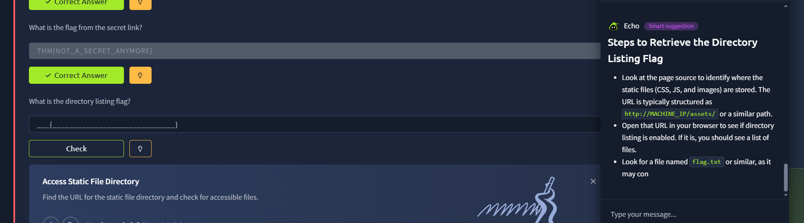

# Acme IT Support: Source-Code Enumeration

**Author:** Kaizen Almoite  
**Environment:** TryHackMe — Walking an Application

## The problem

Find application routes that are not obvious in the rendered page.

## What I investigated

- Inspected the delivered HTML and asset references.
- Used the hidden-link exercise to validate a source-discovery lead.

## What I found

- The HTML exposes `/secret-page`, `/assets/` resources and a comment naming `/new-home-beta`.
- The secret-link answer is marked correct in the lab.
- The directory-listing answer remains blank in the screenshot, so completion of that separate task is not claimed.

## Recommendations

- Enforce authorization independently of navigation visibility.
- Avoid exposing sensitive implementation details in public HTML comments.

## What I learned

A source reference is a discovery lead; access and security impact require separate validation.

## Evidence

**Evidence:** Acme page source exposes /secret-page, /assets/ resources and a comment naming /new-home-beta.

**Interpretation limit:** Source inspection establishes exposed references; it does not by itself prove access to each resource.

**Evidence:** The secret-link answer is marked Correct Answer in the lab.

**Interpretation limit:** The directory-listing answer field is still empty. The suggestion pane is guidance, not proof of completed directory enumeration.
