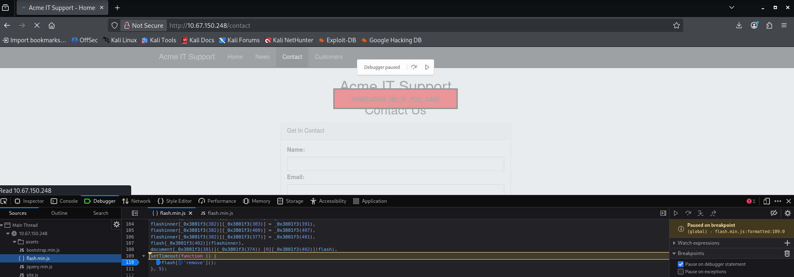

# Client-Side Analysis with Firefox DevTools

**Author:** Kaizen Almoite  
**Environment:** TryHackMe — Walking an Application

## The problem

Inspect transient page behavior and the network activity behind browser interactions.

## What I investigated

- Paused execution in `flash.min.js` near the timeout/removal code.
- Inspected the contact-form response in the Network tab.

## What I found

- The temporary flag remains visible while the debugger is paused.
- The contact-form POST returns HTTP 200 and a JSON message.
- The debugger evidence demonstrates client-side inspection, not a server-side authorization bypass.

## Recommendations

- Do not use quickly removed or hidden browser content as a security boundary.

## What I learned

Debugger and Network reveal different parts of application behavior and support different conclusions.

## Evidence

**Evidence:** Firefox Debugger is paused in flash.min.js while the temporary flag remains visible on the Acme contact page.

**Interpretation limit:** The screenshot shows client-side inspection, not server-side authorization bypass.

**Evidence:** Firefox Network tab: POST /contact-msg returns HTTP 200 and JSON containing Message Received on 10.67.150.248.

**Interpretation limit:** This proves request/response inspection. It does not show a modified request, injection or an authentication bypass.
