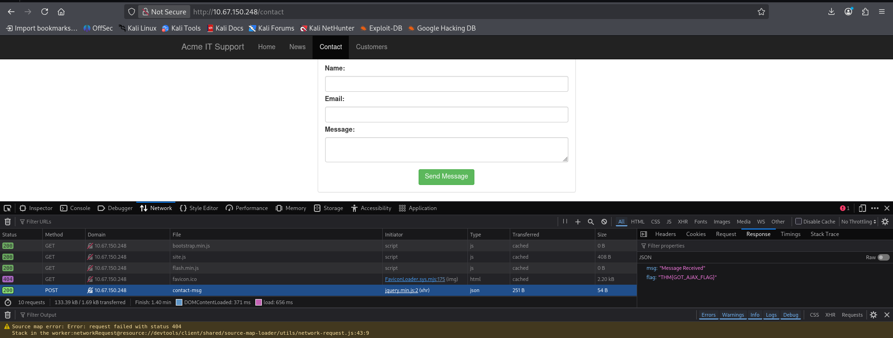

# Contact-Form HTTP Request Analysis

**Author:** Kaizen Almoite  
**Environment:** TryHackMe — Walking an Application

## The problem

Trace a browser form submission to its HTTP request and application response.

## What I investigated

- Used Firefox Network to select the contact-form POST.
- Inspected the response status and JSON body.

## What I found

- `POST /contact-msg` on `10.67.150.248` returns HTTP 200.
- The response contains `Message Received` and the AJAX exercise flag.
- The capture demonstrates request/response inspection; no modified or replayed request is shown.

## Recommendations

- Evaluate the application response alongside the HTTP status when validating behavior.

## What I learned

The Network tab exposes application exchanges that are not necessarily visible in the rendered page.

## Evidence

**Evidence:** Firefox Network tab: POST /contact-msg returns HTTP 200 and JSON containing Message Received on 10.67.150.248.

**Interpretation limit:** This proves request/response inspection. It does not show a modified request, injection or an authentication bypass.
