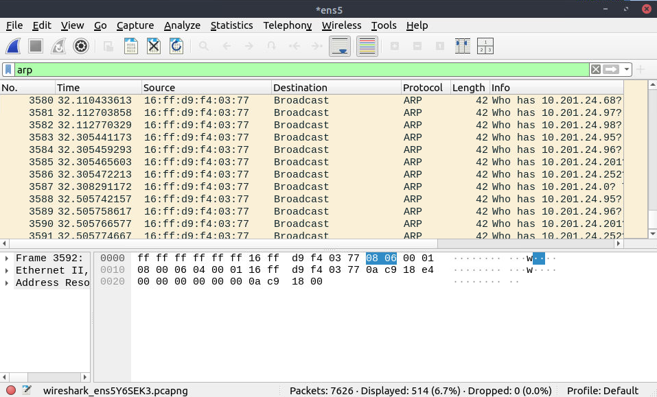

# Packet Analysis: ICMP, TCP Probes and IPv4 Fragments

**Author:** Kaizen Almoite  
**Environment:** TryHackMe Nmap / Wireshark practice — 7 August 2026

## The problem

Check network behavior using packet direction, flags and fragment fields.

## What I investigated

- Filtered the packet list for `10.201.89.221`.
- Compared ICMP exchanges, TCP SYN/ACK probe flags and IPv4 fragment offsets.

## What I found

- Frames 796/807 and 805/806 show ICMP echo and timestamp request/reply pairs.
- Frame 799 shows a SYN to port 443; frame 802 shows an ACK probe to port 80.
- IPv4 rows include offsets 0 and 8 with reassembly annotations.
- The cropped view does not establish a complete TCP handshake, MITM interception or successful firewall evasion.

## Recommendations

- Preserve packet captures and generating commands to support detailed reassembly and attribution.
- Use visible fields to bound conclusions rather than inferring compromise from unusual traffic alone.

## What I learned

Packet-level details can verify scan behavior, but each conclusion must remain within the captured evidence.

## Evidence

**Evidence:** Wireshark filtered on ip.addr == 10.201.89.221, showing ICMP replies, TCP probes and fragmented IPv4 traffic.

**Interpretation limit:** This is a cropped packet view without a recovered PCAP or generating command. It does not establish MITM interception, compromise or successful firewall evasion.

## Additional supporting evidence

### Additional capture — ARP broadcast requests

The `arp` filter displays broadcast requests from MAC `16:ff:d9:f4:03:77` asking for multiple `10.201.24.x` addresses. The selected frame includes Ethernet/ARP bytes. This image shows requests, not host replies, ARP poisoning or an interception result.

## Investigation details

- [Packet Observations](investigation/packet-observations.md)
